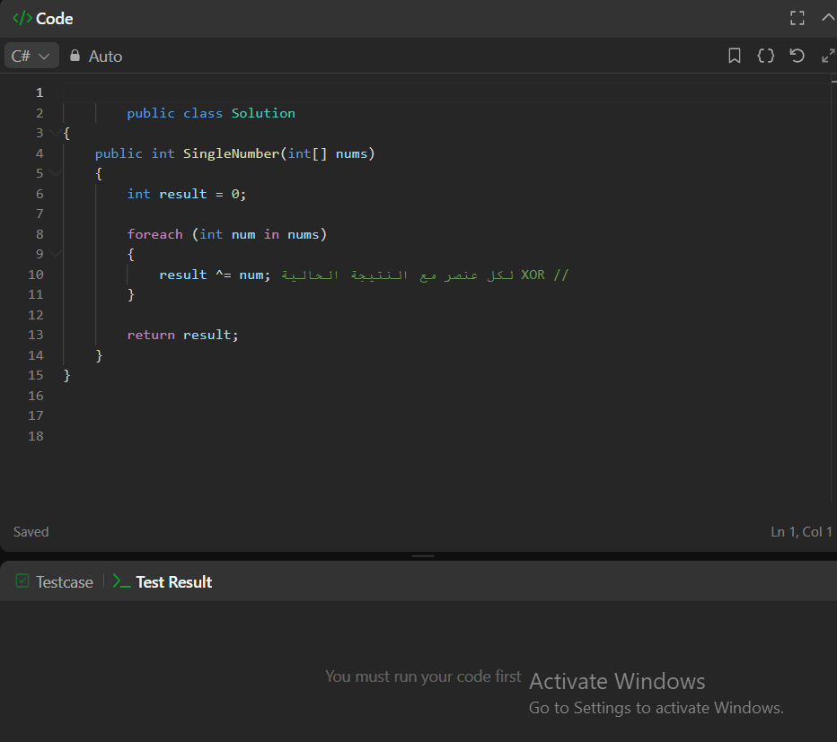

```text
لأن XOR يلغي المكرر
a ^ a = 0،
وأي رقم يظهر مرتين يختفي، فيتبقى فقط الرقم الذي يظهر مرة واحدة
```


    int[] nums1 = { 4, 1, 2, 1, 2 };
    int[] nums2 = { 7, 3, 7 };

    Console.WriteLine(FindSingleNumber(nums1)); // Output: 4
    Console.WriteLine(FindSingleNumber(nums2)); // Output: 3

    